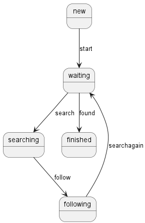

# StateMachine

A minimal basic state machine implementation in Java.

## Overview

StateMachine is a library that provides a framework for implementing state machines in Java applications. It offers a clean and easy API for defining states,
transitions, and the rules that govern state changes.

## Features

- Support for guarded transitions (transitions with conditions)
- Immutable tokens for tracking state
- Clear separation of state machine model and execution
- Deterministic behavior (throws exception if multiple transitions are enabled)

## Installation

```bash
./gradlew assemble
```

## Usage

Here's a simple [example](example/src/main/java/net/npg/example/SimpleStateModel.java) of how to use the StateMachine library:

```java
void test() {
    // create the model
    final var model = new StateModel<>("State Diagram");

    // add the states
    final var newState = model.addState("new");
    final var waiting = model.addState("waiting");
    final var searching = model.addState("searching");
    final var following = model.addState("following");
    final var finished = model.add * * * * State("finished");

    // these are guards which prevent the token to transition to the next state
    final var found = new AtomicBoolean(false);
    final var caught = new AtomicBoolean(false);
    final var startSearch = new AtomicBoolean(false);

    // link all states
    model.addTransition(newState, waiting, () -> true, "start");
    model.addTransition(waiting, searching, startSearch::get, "search");
    model.addTransition(waiting, finished, found::get, "found");
    model.addTransition(searching, following, caught::get, "follow");
    model.addTransition(following, waiting, () -> true, "searchagain");

    // create a start token at any state
    final var token = new Token<>(newState, model);

    final var machine = new StateMachine<String>();
    final var waitingToken = machine.execute(token);
    // State transition from new to waiting is immediate,  the next states are all blocked by th guards
    checkState(newToken, waiting);

    // enable transition startSearch to State searching
    startSearch.set(true);
    final var searchToken = machine.execute(waitingToken);
    ...
}
```

### State Diagram



## License

StateMachine is licensed under the GNU Lesser General Public License v3.0 (LGPL-3.0). See the [LICENSE](LICENSE) file for details.

## Contributing

Contributions are welcome! Please feel free to submit a Pull Request.